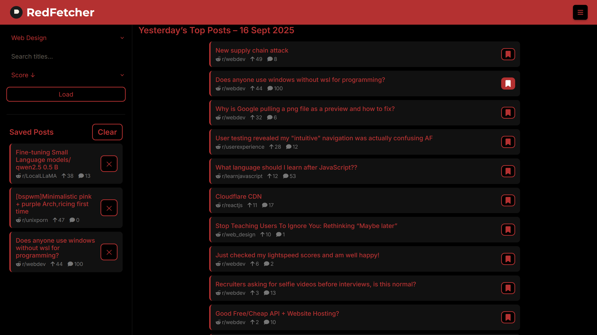

# RedFetcher – Yesterday’s Top Reddit Posts

**A lightweight, web app that shows the best Reddit posts from yesterday for a chosen topic.**

## Features

-   **Topic groups** – pre‑defined collections of subreddits (Web Design, Programming, Self‑Hosting, AI, Desktop & Phone Customisation).
-   **Yesterday‑only** – filters posts by UTC timestamps so you only see what was hot **yesterday**.
-   **Client‑side caching** – results stored in `localStorage` (topic + date) for instant reloads.
-   **Search & sort** – live title search; sort by score, comments, newest or oldest.
-   **Bookmarks** – save posts locally, view them in the collapsible sidebar, remove individually or clear all.

## Quick demo

Open `index.html` in a browser, pick a topic, and explore yesterday’s top posts.  
Saved posts stay in your browser between sessions.

---

_Made with some help from GPT OSS_
