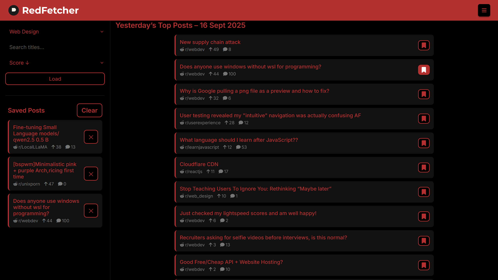

# RedFetcher – Yesterday’s Top Reddit Posts

**A lightweight web app that shows the best Reddit posts from yesterday for a chosen topic.**

## Features

- **Topic groups** – pre‑defined collections of subreddits (Web Design, Programming, Self‑Hosting, AI, Desktop & Phone Customisation).
- **Yesterday‑only** – filters posts by UTC timestamps so you only see what was hot **yesterday**.
- **Client‑side caching** – results stored in `localStorage` (topic + date) for instant reloads.
- **Search & sort** – live title search; sort by score, comments, newest or oldest.
- **Bookmarks** – save posts locally, view them in the collapsible sidebar, remove individually or clear all.

## Quick demo

Open `index.html` in a browser, pick a topic, and explore yesterday’s top posts.  
Saved posts stay in your browser between sessions.

---

## Description

A Reddit daily digest web app — ~60 curated subreddits in 6 topics, fetches the previous day's top posts, caching, offline via service worker, search, sort modes, bookmarks. Vanilla JS, zero dependencies, no backend. Shared on GitHub — friends use it and fork the subreddit list.

## Planned features

- Integration into the planned dashboard.
- Add LICENSE + .gitignore; possibly split the JS out of the HTML; GitHub Pages deployment note.
- User-configurable subreddit groups — a `config.json` alongside `index.html` defines groups and their subreddits; falls back to built-in defaults when missing. Possible extensions: settings UI (localStorage) and query-parameter sharing (`?groups=programming:rust,python`).

## Known bugs

- Cache defeated on every load: init calls `loadBtn.click()` → loadTopic with forceRefresh (index.html:461-463, 491) — the cache guard always falls through; "instant reloads" is inert.
- `manifest.json` linked (index.html:11) but the file doesn't exist.
- Corrupt cache kills the app: unguarded `JSON.parse(cached)` (index.html:258) and `getSaved()` (index.html:390) — and corrupt entries leave stale display status.
- 429 responses cached unconditionally — Reddit rate-limit errors get stored as regular content.
- Cross-origin fetch fallback can serve index.html as CSS/JS.
- Bookmark-toggle timing race — rapid toggling loses the bookmark state.
- Silent subreddit failures: Promise.allSettled rejections dropped (index.html:274-288) — all-fail yields "No posts match your query."
- Filter window mismatch: fetches Reddit's rolling 24h `t=day`, then narrows to the calendar UTC day — early-UTC posts get discarded.
- SW precache omits style.css, never prunes old caches; offline fallback breaks under subpath hosting.
- innerHTML with interpolated network data (index.html:294, 356-360, 432-436) — low practical risk, stored-XSS shape.
- No .gitignore, no LICENSE, 303 KB screenshot committed, zero tests.
